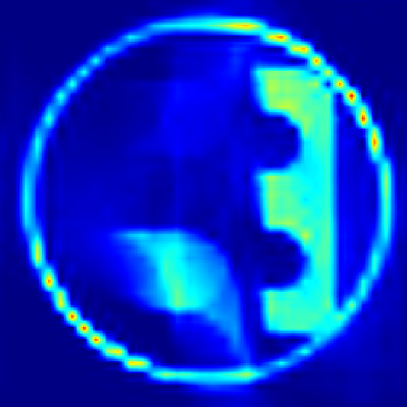
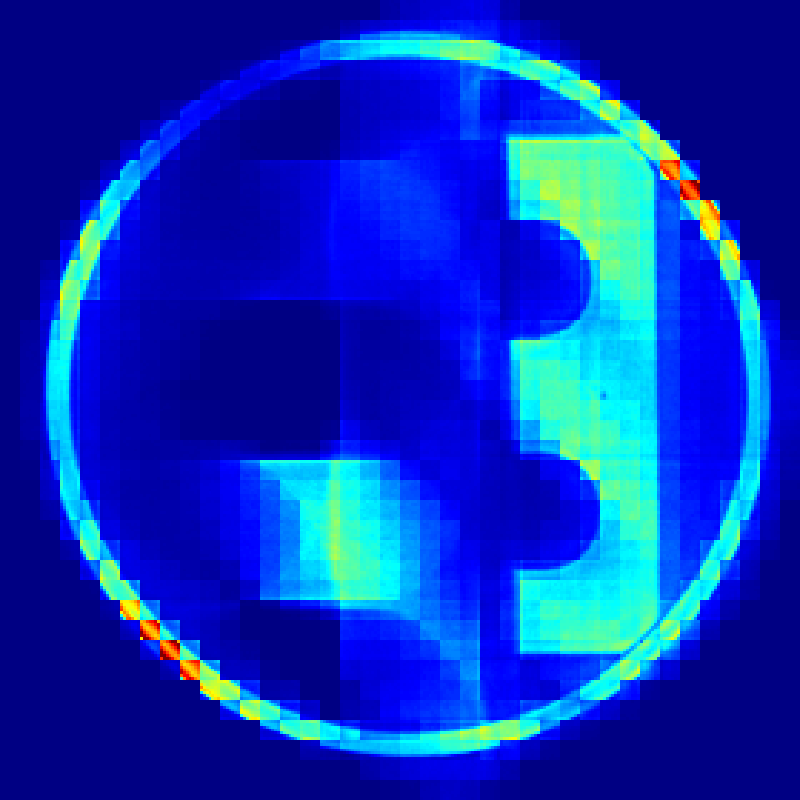
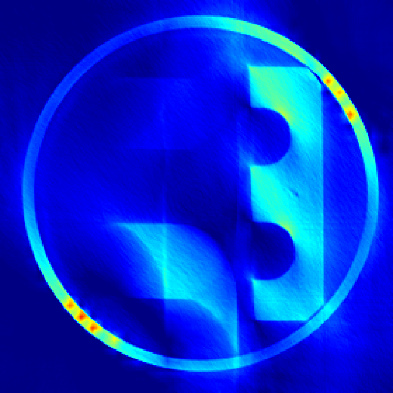
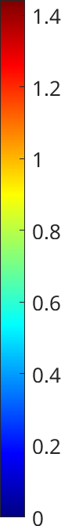
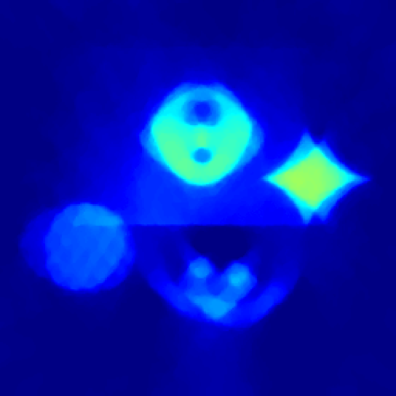

# WaveletLowRank

by Tommi Heikkilä, LUT University  
<a href="https://orcid.org/0000-0001-5505-8136" aria-label="View ORCID record">

0000-0001-5505-8136</a>  
<a href="https://github.com/tommheik/" aria-label="View Github page">

tommheik
</a>  

## MultiResolution Low-Rank (MRLR) Algorithm for dynamic X-ray tomography.
(And some other low-rank algorithms.)

<div class="row">




 
</div>

_From left to right: **MRLR**, LLR, L+S and FTVNNR methods. Example reconstructions using the [STEMPO](https://doi.org/10.1007/978-981-97-6769-4_1) data. Time step t=4 is shown._

<div class="row">



</div>

_From left to right: ground truth, **MRLR**, LLR and FTVNNR methods. Example reconstructions using simulated data. All 32 times steps are shown (gifs not necessarily in sync)._

These codes were used to obtain the numerical results in  

> <a id="1">[1]</a> T. Heikkilä,  
"MultiResolution Low-Rank Regularization of Dynamic Imaging Problems"
Scale Space and Variational Methods in Computer Vision. SSVM 2025. _Lecture Notes in Computer Science_, vol 15667. Springer.
_DOI_: [10.1007/978-3-031-92366-1_6](https://doi.org/10.1007/978-3-031-92366-1_6)  
_arXiv pre-print_: [2502.20977](https://arxiv.org/abs/2502.20977) (2025)

Please cite the following if you use these codes:

    @inproceedings{heikkila2025multiresolution,
        title={{MultiResolution Low-Rank Regularization of Dynamic Imaging Problems}},
        author={Heikkilä, Tommi},
        booktitle={International Conference on Scale Space and Variational Methods in Computer Vision},
        pages={70--82},
        year={2025},
        series={LNCS, volume 15667},
        organization={Springer}
    }

### Contents

- `LowRank_comparison_2d_main.m` runs all algorithms using either the provided [simulated data](/data/) or the [STEMPO](https://doi.org/10.1007/978-981-97-6769-4_1) dataset which is available in Zenodo: [10.5281/zenodo.8239013](https://zenodo.org/record/8239013). The underlying problem is dynamic X-ray tomography.

    The Low-rank based regularization algorithms are
    - **[MRLR**] Multiresolution Low-rank: wavelet domain patched low-rank as explained in the article [[1]](#1).
    - [**LLR**] Local low-rank: traditional patch based method as explained in the article [[1]](#1).
    - [**L+S**] Low-rank + sparse: as explained in [[2]](#2) and [[3]](#3).
    - [**FTVNNR**] Fast Total Variation + global low rank regularization: as explained in [[4]](#4) and [[5]](#5).
- `simulate_dynamic_data.m` is used to generate the simulated data.
- [`algorithm`](/algorithm/) contains the different reconstruction algorithms and some standalone codes. Standalone codes may be slightly out of date.
- [`util`](/util/) contains additional utility codes.
- The FTVNNR algorithm is used as-is, with the exception of minor change on [line 38](https://github.com/uta-smile/FTVNNR_Dynamic_MRI_MEDIA/blob/d6166512a884930d5c15652632c2d6c8519d7303/FTVNNR_utilies/TVLR_opt.m#L38) of `TVLR_opt.m` which needs to be changed to  
    ```[m, n, T, C] = size(F_gt);```  
    or similar, since in CT the data (sinogram) is rarely the same size as the desired reconstruction.

### Toolboxes and references <a name="tools"></a>

LLR and MRLR algorithms use the Primal-Dual Fixed Point (PDFP) algorithm [[6]](#6) for minimization.

The Discrete Wavelet Transform requires the [**Wavelet Toolbox**](https://www.mathworks.com/products/wavelet.html).

The tomography forward operator is computed using the [**ASTRA Toolbox**](https://astra-toolbox.com/) <a name="astra"></a>
> W. Van Aarle, W. J. Palenstijn, J. Cant, E. Janssens, F. Bleichrodt, A. Dabravolski, J. De Beenhouwer,
K. J. Batenburg and J. Sijbers, "Fast and flexible x-ray tomography using the ASTRA toolbox", 
_Opt. Express_ 24 25129–47 (2016).

> W. Van Aarle, W. J. Palenstijn, J. De Beenhouwer, T. Altantzis, S. Bals, K. J. Batenburg and J. Sijbers, "The ASTRA toolbox: a platform for advanced algorithm development in electron tomography", _Ultramicroscopy_ 157 35–47, (2015).

The algorithm also uses **Spot** and **HelTomo** <a name="heltomo"></a>
> E. Van den Berg and M. P. Friedlander, "Spot - a linear-operator toolbox", v1.2, (2013) http://cs.ubc.ca/labs/scl/spot

> A. Meaney, "HelTomo - Helsinki Tomography Toolbox", v2.0.0, (2022) https://github.com/Diagonalizable/HelTomo

The **Fast Total Variation and Nuclear Norm Regularization** codes are related to [[4,5]](#4) and are available on [github.com/uta-smile/FTVNNR_Dynamic_MRI_MEDIA/](https://github.com/uta-smile/FTVNNR_Dynamic_MRI_MEDIA/)


### License

My codes are licensed under [GNU General Public 3.0](/LICENSE) license.

The FTVNNR codes have no formal license.

### References

> <a id="2">[2]</a> Ricardo Otazo, Emmanuel Candes, and Daniel K. Sodickson. "Low‐rank plus sparse matrix decomposition for accelerated dynamic MRI with separation of background and dynamic components". _Magnetic resonance in medicine_ 73.3 (2015): 1125-1136.

> <a id="3">[3]</a> Hao Gao, Jian-Feng Cai, Zuowei Shen, and Hongkai Zhao. "Robust principal component analysis-based four-dimensional computed tomography". _Physics in Medicine & Biology_, 56(11), 3181, (2011).

> <a id="4">[4]</a> Jiawen Yao, Zheng Xu, Xiaolei Huang, and Junzhou Huang. "An efficient algorithm for dynamic MRI using low-rank and total variation regularizations." _Medical image analysis_ 44 (2018): 14-27.

> <a id="5">[5]</a> Jiawen Yao, Zheng Xu, Xiaolei Huang, and Junzhou Huang. "Accelerated dynamic MRI reconstruction with total variation and nuclear norm regularization." _International Conference on Medical Image Computing and Computer-Assisted Intervention_. Cham: Springer International Publishing, (2015).

> <a id="6">[6]</a>  Peijun Chen, Jianguo Huang, and Xiaoqun Zhang. "A primal–dual fixed point algorithm for convex separable minimization with applications to image restoration." _Inverse Problems_ 29.2 (2013): 025011.
